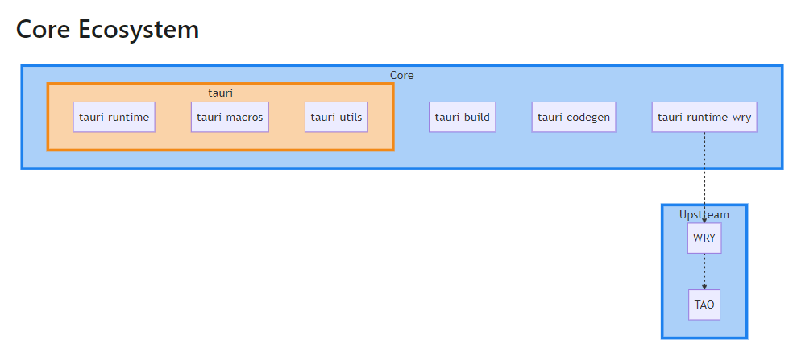
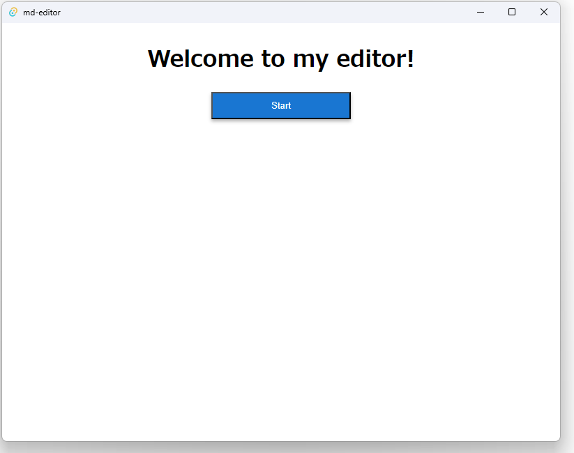
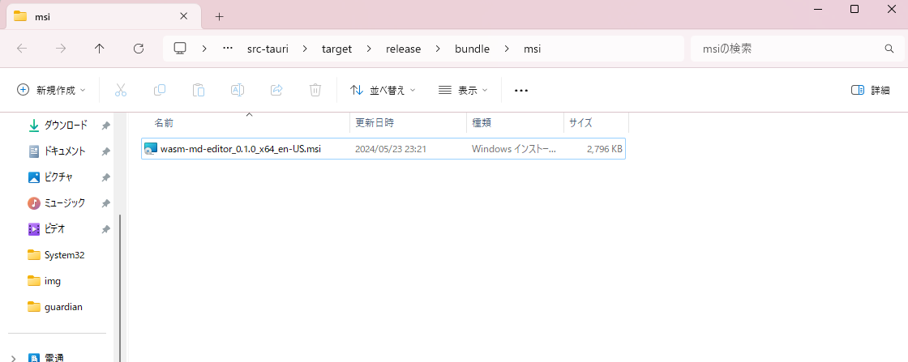
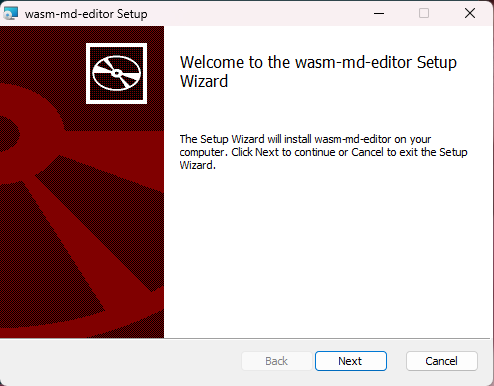
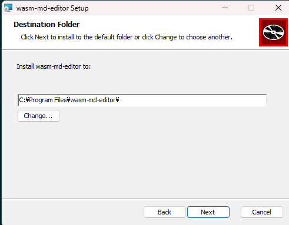
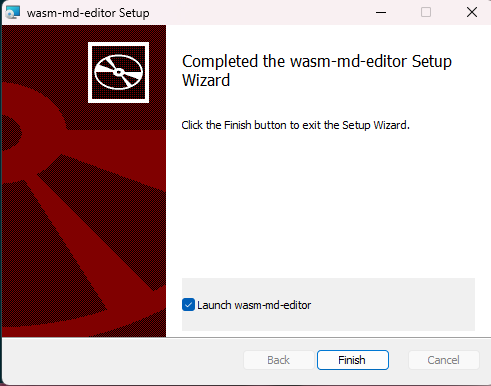

# Tauriを使ってMarkdownエディタをデスクトップアプリにしてみる
# 目次
- [Tauriを使ってMarkdownエディタをデスクトップアプリにしてみる](#tauriを使ってmarkdownエディタをデスクトップアプリにしてみる)
- [目次](#目次)
- [Tauri 概要](#tauri-概要)
  - [そもそもWebViewとは](#そもそもwebviewとは)
- [Tauriアーキテクチャ](#tauriアーキテクチャ)
- [Tauri導入](#tauri導入)
- [Tauri development window起動](#tauri-development-window起動)
- [Windowsインストーラ(.msi)を作る](#windowsインストーラmsiを作る)
- [アプリのアイコンを変える](#アプリのアイコンを変える)

# Tauri 概要

- Rust 製の軽量なデスクトップアプリ開発フレームワーク。
- 従来は Electron が主流（vscode, discord が代表例）だったが、Tauri が「軽量版Electron」として注目を集めている。
- 両者の違いは内部のレンダリング部分にあり
  - Electron は内部に Chromium を組み込んでいるが、Tauri は OS の WebView 機能を呼び出せるラッパー(WRY)を使っている
  - そのためTauriが「軽量で高速」という点で優位
- Git のスター数も Electron をまくる勢いで伸びている
  


## そもそもWebViewとは
Webページをデスクトップアプリケーションに埋め込んで利用できるようにするもの。各OSに標準で組み込まれている。

| OS | 組み込まれているWebView |
| :------ | --------- |
| windows | WebView2 |
| linux | WebKitGTK |
| macOS | WebKit |


# Tauriアーキテクチャ

https://tauri.app/v1/references/architecture/

- tauri
  - tauri の主要パッケージをまとめたもので、内部に tauri ランタイムを持つ
- tauri-runtime-wry
  - WRYを制御するためのtauriランタイム
- WRY
  - WRYは各OSのWebViewをサポートしたラッパーライブラリ。tauriからOS標準のWebView機能を提供する。
- TAO
  - アプリケーションのウインドウを操作するためのライブラリ


# Tauri導入

```bash
$ cargo install tauri-cli
$ cargo tauri init

warning: `C:\Users\li3248\.cargo\config` is deprecated in favor of `config.toml`
note: if you need to support cargo 1.38 or earlier, you can symlink `config` to `config.toml`
warning: `C:\Users\li3248\.cargo\config` is deprecated in favor of `config.toml`
note: if you need to support cargo 1.38 or earlier, you can symlink `config` to `config.toml`
✔ What is your app name? · wasm-md-editor
✔ What should the window title be? · md-editor
✔ Where are your web assets (HTML/CSS/JS) located, relative to the "<current dir>/src-tauri/tauri.conf.json" file that will be created? · ../dist
✔ What is the url of your dev server? · http://127.0.0.1:8080
✔ What is your frontend dev command? · trunk serve
✔ What is your frontend build command? · trunk build
```

フォルダ構成図

```
wasm-md-editor
├─dist
├─doc
│  └─img
├─public
├─src
│  ├─components
│  └─pages
├─src-tauri ※新規作成される
│  ├─icons
│  └─src
└─target
```

# Tauri development window起動

```bash
$ cargo tauri dev
```



# Windowsインストーラ(.msi)を作る

- msiファイルのビルド
````bash
$ cargo tauri build

````
- ``src-tauri/target/release/bundle/msi``フォルダにmsiファイルが作成される

- .msiを実行





# アプリのアイコンを変える
- 画像を用意（正方形じゃないと怒られる）
- 以下コマンドでIcon画像を作成し、アイコンに設定する
````bash
$ cargo tauri icon ./src-tauri/icons/editor-icon.png
````

- tauri.conf.json内で任意の画像を指定することも可能
````json
      "icon": [
        "icons/Square30x30Logo.png",
        "icons/Square142x142Logo.png",
        "icons/Square310x310Logo.png",
        "icons/icon.icns",
        "icons/icon.ico"
      ],

````